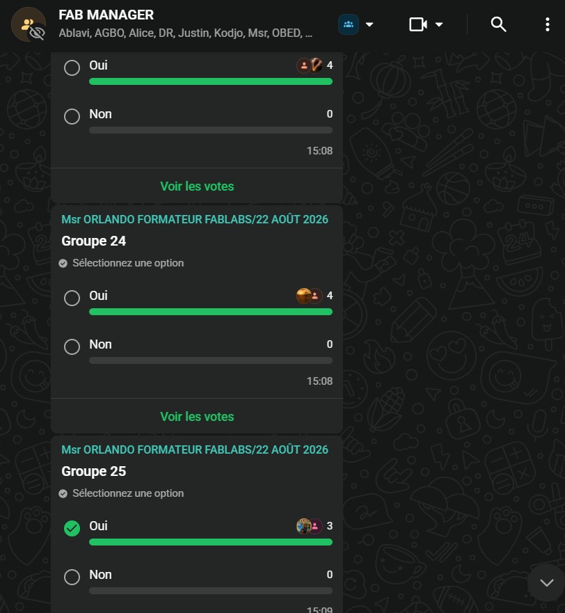

# Journal du 25 août 2026 (rédigé par : Winiga Kekeli BAFAYA)

## Fait aujourd'hui

- Initialisation des dépôts et intégration d'une organisation sur GitHub
- Révision : ouvrir un dossier dans VSCode, créer un fichier Markdown
- Création de commits (rédaction correcte du message) et authentification auprès de GitHub
- Journalisation quotidienne (première entrée)
- Formation des groupes de travail : constitution de 25 groupes au total, dont 24 groupes de 4 personnes ; affectation au groupe 25, constitué de 3 personnes
- Discussion des différences entre atelier, makerspace et fablab
- Présentation de la charte des fablabs, des réseaux existants (international, régional, Togo) et de la vision du gouvernement togolais sur les fablabs
- 

## Appris

- Les cinq gestes du cycle Git quotidien : synchroniser en arrivant → modifier → indexer (add) → commettre (commit) avec message → synchroniser en partant
- Un commit seul ne met rien en ligne ; il faut synchroniser (push) pour que ça apparaisse sur GitHub, avec 1 à 2 minutes de retard côté GitHub Pages
- La convention de message de commit imposée : `type(portee): description` (types admis : ajout, correction, docs, refactor, test)
- Les distinctions atelier / makerspace / fablab, et le paysage des réseaux fablab (international, régional, Togo)

## Raté, puis corrigé

- Échec de soumission de commits → cause : problèmes d'authentification auprès de GitHub → correction tentée : ré-authentification → résultat : commits acceptés après correction
- Messages de commit oubliés ou mal formatés → cause : non-respect de la convention `type(portee): description` → correction tentée : reprise des messages selon le format imposé → résultat : conformité rétablie

## Décidé

- Création de 25 groupes de travail (24 groupes de 4 personnes) → affectation au groupe 25, constitué de 3 personnes

## À faire demain

- Réception et étude de l'assignation des cahiers des charges
