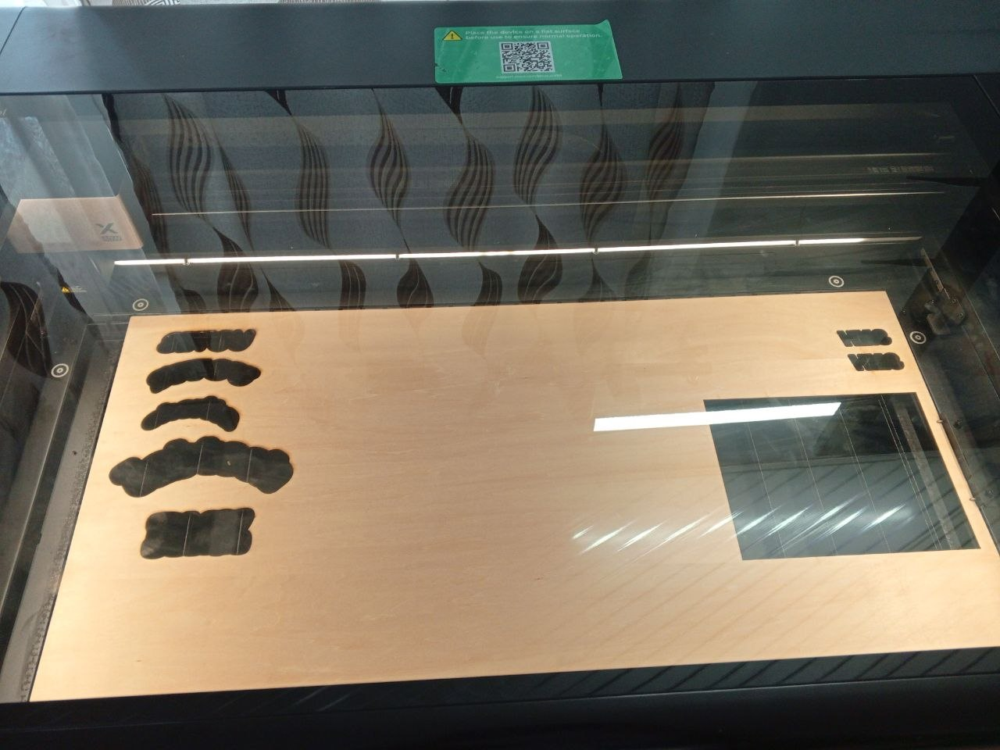
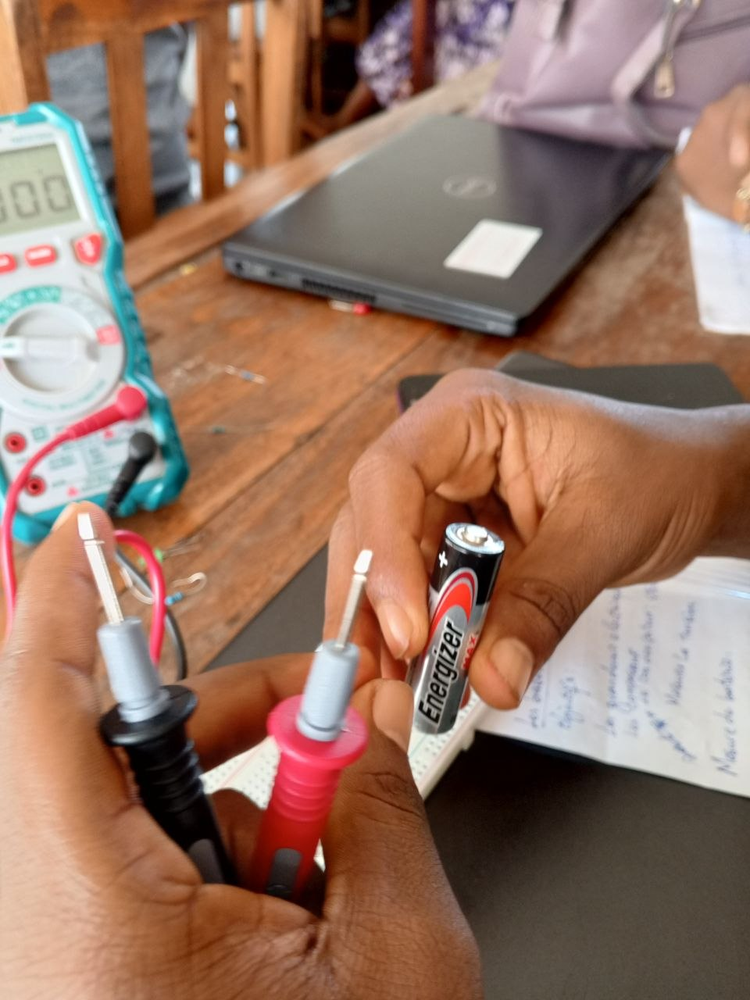

# Journal du 26 Août 2026 (rédigé par : Winiga Kekeli BAFAYA)

## Fait aujourd'hui

- Répartition en 4 groupes de ± 23 à 25 personnes pour effectuer des rotations dans 4 salles : projet, découpe laser, électronique (fablab) et fabrication additive 3D.
- Présentation des types de projets à réaliser dans la suite de la formation.
- Introduction aux microcontrôleurs, notamment le XIAO ESP32 S3, utilisé avec MicroPython (au lieu du langage C d'Arduino), et découverte de l'utilisation des périphériques d'entrée/sortie.
- Présentation des différentes technologies de découpe laser existantes : CO2, fibre, diode, UV, ainsi que des paramètres à prendre en compte selon le travail à réaliser.
- Rappels de sécurité et prise en main du logiciel xTool pour effectuer quelques essais de découpe.
- 
- Cours d'électronique : utilisation des appareils de mesure pour la tension, le courant et la résistance, puis mesure de l'état du fusible des multimètres.
- 
- Cours de fabrication additive (impression 3D) : consignes, caractéristiques des logiciels et présentation des différentes parties d'une imprimante 3D.
- Présentation de l'environnement des projets et étude de la faisabilité, en privilégiant les projets en lien avec l'éducation.
- Visite d'une délégation de l'Union européenne, venue féliciter et encourager la promotion dans la suite du travail.

## Appris

- Fonctionnement d'une imprimante 3D et les différents types d'imprimantes utilisés en fabrication additive.
- Comment réaliser une découpe laser.
- Le rôle de chaque composant électronique, comment calculer une résistance et comment mesurer la capacité des composants au multimètre.
- Comment organiser un projet.

## Raté, puis corrigé

- Mesure de la capacité des composants.

## Décidé

## À faire demain

- Pratique avec Fusion 360 pour la modélisation et xTool pour la découpe.
- Choix d'un projet parmi 125 projets proposés, avec l'accompagnement des formateurs.