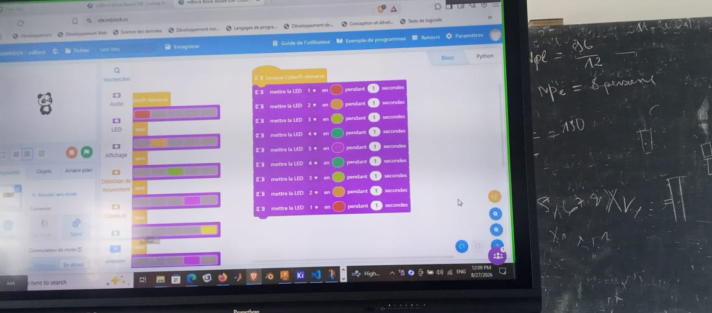

# Journal du jeudi 27 août 2026 (rédigé par :BAFAYA Winiga Kekeli)

## Fait aujourd'hui

- Cours de fabrication additive (impression 3D) : suite des chapitres sur l'installation et le réglage des paramètres d'un slicer (Bambu Studio), types de slicers, réglage de la température du plateau et de la buse, choix et motifs de remplissage, découpe du plateau et format de fichier à respecter.
- Salle projet : début de l'installation du logiciel Fusion 360 (Autodesk).
- Atelier découpe laser : conception, configuration et découpe de cartes de visite avec les paramètres suivants :
  - Découpe du contour : Puissance = 90 %, Vitesse = 50 %
  - Gravure (remplissage) : Puissance = 20 %, Vitesse = 600 %
  - Gravure du contour : Puissance = 20 %, Vitesse = 400 %
- Atelier électronique (FabLab) : présentation du CyberPi et de ses composants 
, ainsi que du capteur à ultrasons associé .
- Programmation sous mBlock pour allumer et animer 5 LED RGB de couleurs différentes, simulant une guirlande lumineuse .

## Appris

- Les différents types de slicers existants et leurs particularités respectives.
- L'impact des réglages de température (plateau et buse), du taux et des motifs de remplissage sur une impression 3D.
- Les couples puissance/vitesse à utiliser sur la découpeuse laser selon l'opération visée : découpe de contour (90 % / 50 %), gravure de surface (20 % / 600 %) et gravure de contour (20 % / 400 %), trois réglages bien distincts pour un même matériau.
- Structure et composants du CyberPi, et écriture d'un bloc de code mBlock séquentiel (`mettre la LED [n] en [couleur] pendant 1 seconde`) pour piloter individuellement 5 LED RGB.

## Raté, puis corrigé

- Échec de l'installation de Fusion 360 → hypothèse de cause : problème de connexion réseau au moment du téléchargement → correction tentée.
