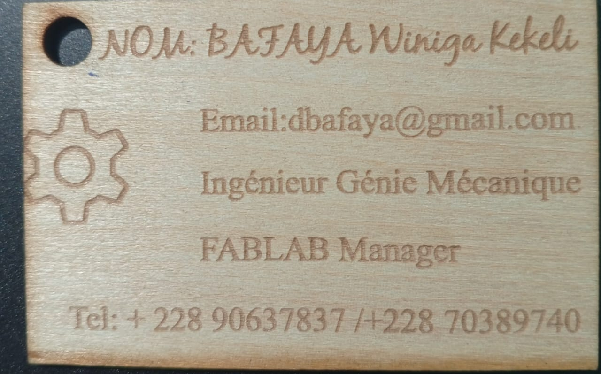
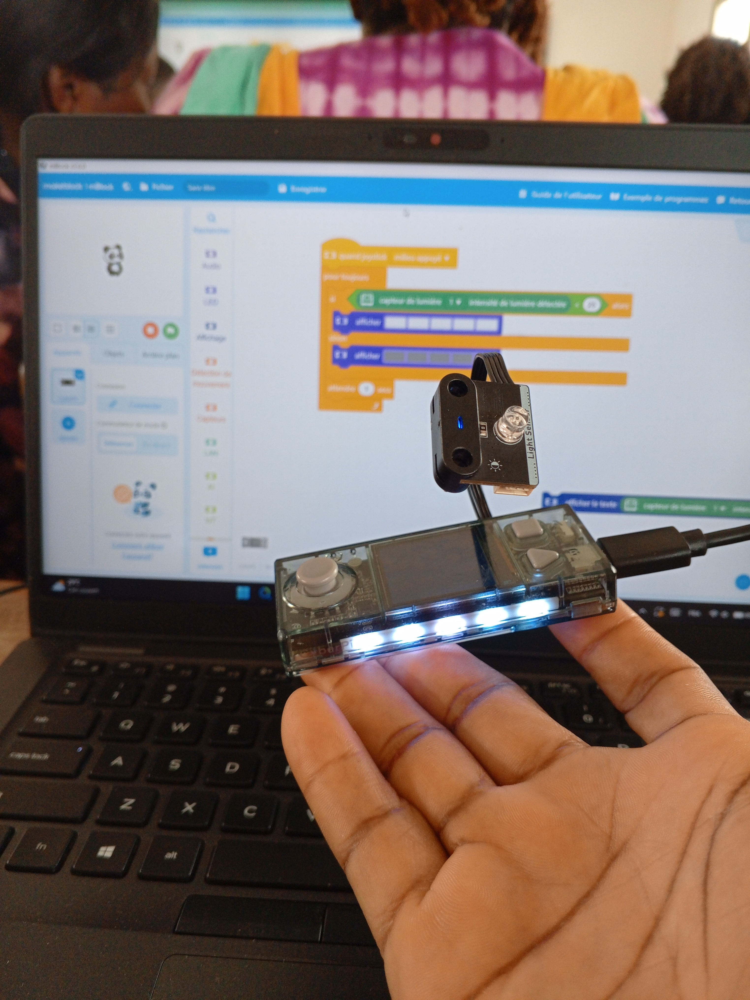

# Journal du vendredi 28 août 2026 (rédigé par : Winiga Kekeli BAFAYA)

## Fait aujourd'hui
- Atelier de découpe laser pour finaliser et faire les travaux pratiques sur le logiciel Xtool Studio et découpe des cartes de visite faites le 27 août 2026.

 

- Atelier d'impression 3D avec l'ingénieur LOLO. Lors de cet atelier, nous avons fait une importation d'une pièce qui est une pose portable et fait ensuite les réglages comme les supports, l'orientation, le remplissage, le choix de l'imprimante et le choix des filaments. Ensuite, nous avons fait les impressions sur les machines dédiées selon les réglages et les filaments.
- Atelier d'électronique dans un fablab. Durant notre passage dans cet atelier, nous avons fait des travaux pratiques avec les composants comme le CyberPi, le capteur de lumière et les câbles enfichables plus le logiciel de codage mBlock. L'expérience réalisée est de faire un code qui grâce au light sensor va permettre de détecter la luminosité et de les afficher sur l'écran du CyberPi.

- Salle de projet : le module de cette journée a porté sur le design thinking et la méthode spirale. Lors de la séance, nous avons eu à parler des sujets comme :
  - les différentes étapes d'un design thinking qui sont :
     - Empathie ;
     - Définir : une phrase, et une seule ;
     - Idéer : ouvrir largement et refermer explicitement ;
     - Prototyper sans rien fabriquer ;
     - Tester : observer un usage réel, se taire et noter.
  - Le design thinking vient et sert à :
     - Une méthode de conception ;
     - Centrée sur l'usager ;
     - Ouvrir puis trancher ;
     - Une origine documentée.
  - Ensuite, nous avons terminé la séance avec la méthode en cascade ou en spirale.

## Appris
- Le passage de la conception (Xtool Studio) à la découpe physique d'une carte de visite, en réutilisant les réglages laser établis la veille (contour, gravure de surface, gravure de contour).
- Le flux complet d'une impression 3D pièce par pièce : import du modèle, réglage des supports et de l'orientation, choix du taux de remplissage, sélection de l'imprimante et du filament adapté avant lancement.
- La lecture et l'affichage de données de capteur en temps réel avec le CyberPi : câblage du capteur de lumière, programmation mBlock pour convertir une mesure de luminosité en affichage sur l'écran du module.
- Les cinq étapes du design thinking (empathie, définir, idéer, prototyper, tester) et sa logique : une démarche centrée sur l'usager, qui ouvre largement les possibilités avant de trancher explicitement.
- La distinction entre méthode en cascade et méthode en spirale pour la gestion d'un projet.

## À faire demain

- Révision générale de tout ce qui a été fait toute la semaine
- Choix et discussion sur les projets afin de pouvoir clôturer le premier jalon