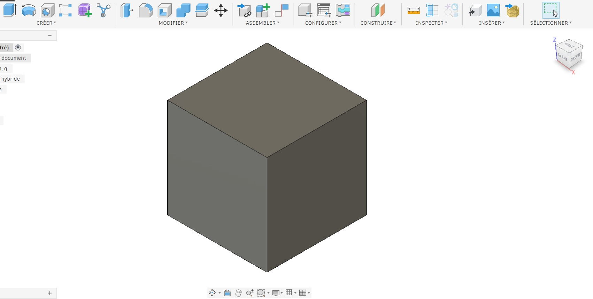

# **Journal du 31 Août 2026 (Rédigé par BAFAYA Winiga Kekeli)**

## **Atelier (Gestion de projet)**

### **Fait aujourd'hui**
---

| Elements | Details |
|---|---|
| Thèmes | Choix definitif des projet et validation |

### Activités
---
- Lors de l'atelier de gestion de projet, nous avons discuté en afin de pouvoir choisir le projet et commencer la redaction de la fiche de projet , du cahier des charges et la liste du materiels pour la realisation du projet.
  - Le projet retenu est : **Balance électronique connectée à enregistrement de données**

## **Atelier de conception Assisté par Ordinateur**

### **Fait aujourd'hui**
---
### Activités
---
- Le second atelier a porté sur la CAO présenté par Monsieur SITU.
  Cet atelier a porté sur les details suivants:
   - Les esquisses: comment et c'est quoi une esquisse.
   - Les projections des vues et leurs importances.
   - Vue de coupe
   - La mises en plan 2D
   - Les symboles de cotation
   - Les differents atelier present dans fusion comme: conception, rendu, simulation,...etc
   - Les differentes types de conceptions presente dans Fusion 360 par rapport au autres logiciel de conception comme freecad ou solidworks
   - Et une premiere pieces cubique de 10X10X10 mm dessinée dans fusion 360.

| Piece cubique de 10X10X10mm |
| --- |
|  |

### **Appris**
---
- Faire la modelisation 3D dans fusion 360
- Faire le choix d'un projet et la redaction de la fiche de projet et le cahier des charges

### **Raté, puis corrigé**
---
- Difficultés rencontrées lors de la sélection, en raison de la diversité des avis au sein du groupe puis choix definitif.

### **À faire demain**
---
- Poursuivre les echanges pour afiner le projet et bien commencer — Groupe 25
- Suite de la formation sur fusion 360