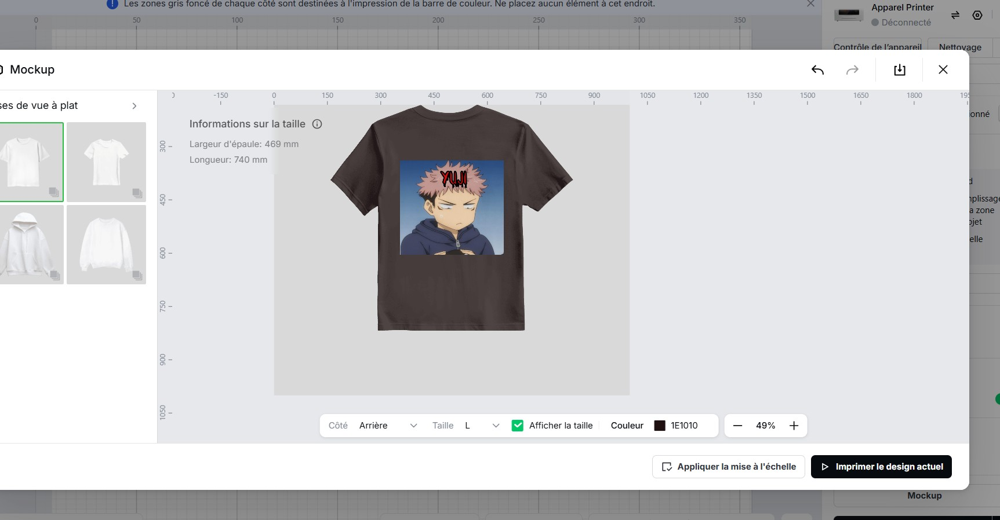

# **Journal du 01 Septembre 2026 (Rédigé par BAFAYA Winiga Kekeli)**

## **Atelier (**Atelier de conception Assisté par Ordinateur**)**

---
### Activités
---
- Créer un cylindre de 3 manières possible:
  - Outil de revolution
  - Bossage extruder
  - Outil créer un cylindre
- Création de porte clé afin de constater si les autres exercices sont maitrisé

## Atélier (Impression DTF avec XTool)

---
### Activités
---
- Lors de l'atélier d'impression DTF, nous avons fait le design et l'impression des logo ou images pour les habits dans l'outil XTool studio en choisant la machine Apparel Printer

| |
| --- |
|  |

## Atélier (Electronique dans un FabLab)

---
### Activités
---
- Dans cet atélier, nous avons appris comment la breadboard SK 10 fonctionne et la disposition de chaque colonne et ligne.
- Nous avons fait les circuit avec une résistance, une LED, et les shunts
- Nous avons fait un circuit avec deux résistances, deux LED et des shunts

## **Appris**
---
- A faire de l'impression DTF pour la personnalisation des vetements, sacs et autres.
- A faire les circuit sur une plaque equipotentielle comme la breadboard SK 10 .

### **À faire demain**
---
- Suite de la formation sur Fusion
- Suite de la formation sur l'electronique
- suite des projets - Groupe 25