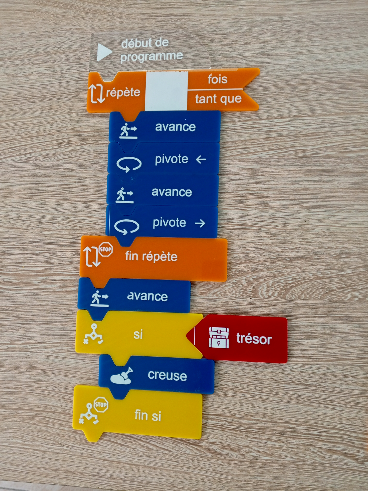
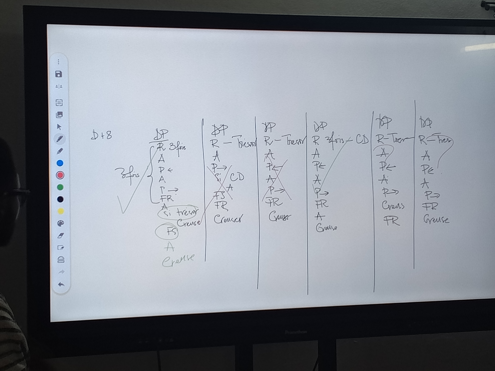
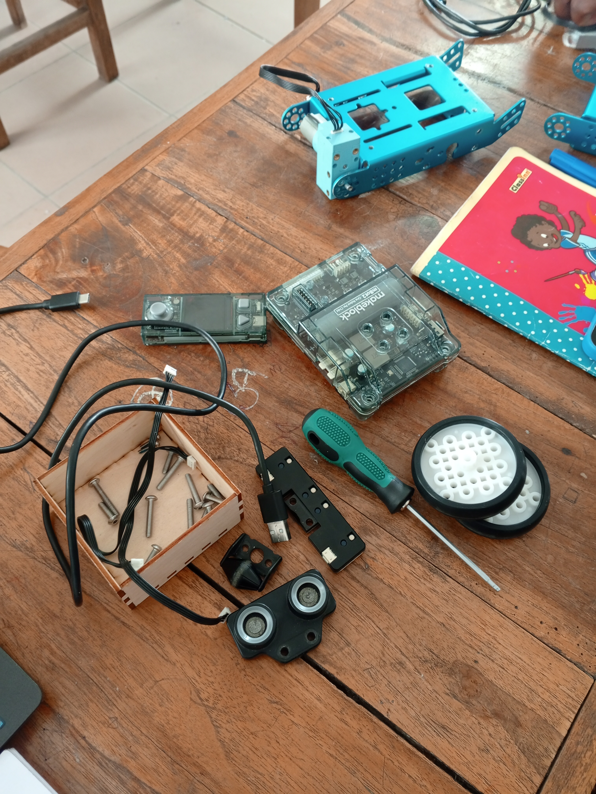
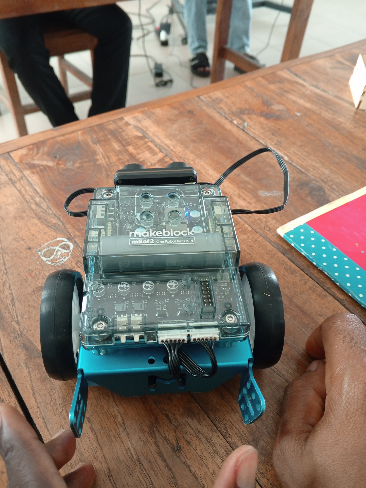
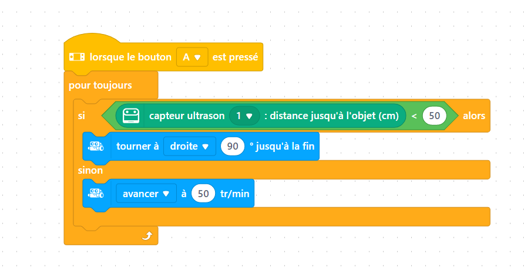

# **Journal du 02 Septembre 2026 (rédigé par BAFAYA Winiga Kekeli)**

## **Atelier : Gestion de projet**

---
### Activités
---

- Discussion sur le projet en groupe.
- Rédaction de la première version du projet en respectant la méthode spirale.
- Compréhension du principe de fonctionnement de la balance électronique.
- Esquisse à main levée du modèle et choix des dimensions externes de la balance (23 cm x 29,5 cm x 12,5 cm) et du plateau de pesée.

| |
| --- |
|  |

## **Atelier : Algorithmique débranchée**

---
### Activités
---

- Définition de l'algorithme et de l'algorithmique débranchée.
- Exercice d'identification des algorithmes finis.
- Exercice avec des blocs pour simuler un algorithme d'un robot qui doit parcourir un chemin afin de déterrer un trésor.

| |
| --- |
|  |

| Solution en D + 8 lignes |
| --- |
|  |

## **Atelier : Électronique dans un Fablab**

---
### Activités
---

- Montage d'un robot mbot2 en assemblant les composants.

| Robot en pièces |
| --- |
|  |

- Après montage, le robot a été programmé pour faire une marche, puis pour détecter un obstacle et tourner à droite ou à gauche selon l'utilisateur.

- Après avoir fait le codage en blocs pour faire avancer le robot voiture et détecter les obstacles, nous avons procédé au démontage et à la connaissance de tout le processus.

## **Appris**
---

- À faire la programmation afin d'actionner un robot.
- Comment faire un algorithme débranché.
- Comment bien faire un projet en allant étape par étape au lieu de commencer à faire la programmation sans faire une esquisse à main levée ni comprendre son principe de fonctionnement.

### **À faire demain**
---

- Suite de la formation sur Fusion.
- Suite de la formation sur l'électronique.
- Suite des projets - Groupe 25.
