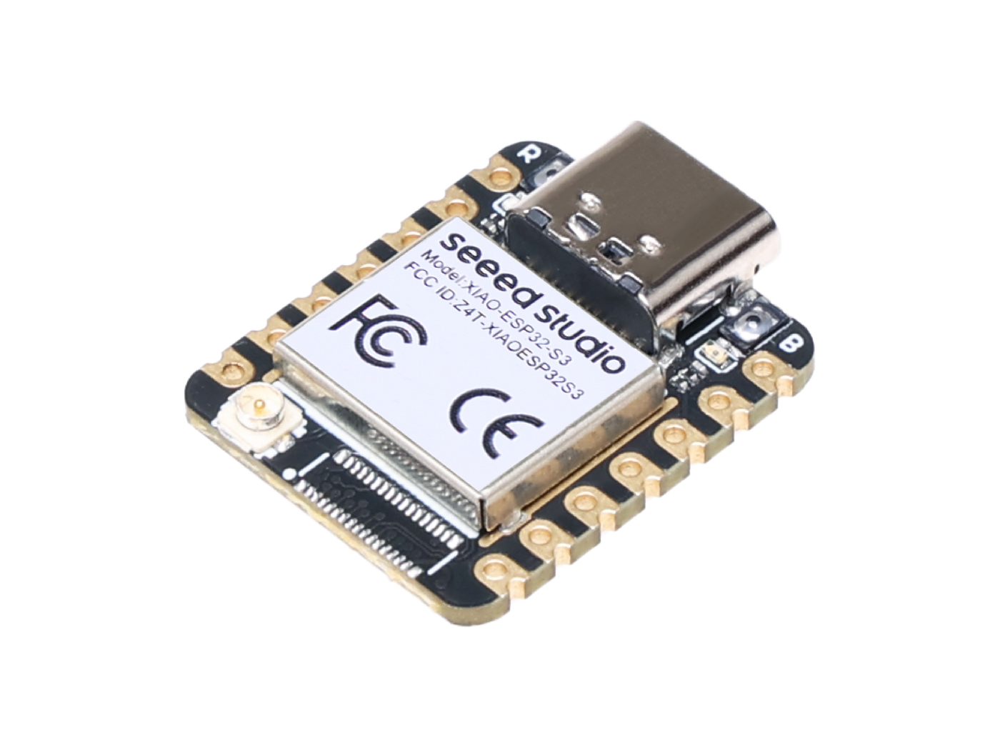

# **Journal du 3 septembre 2026 (rédigé par BAFAYA Winiga Kekeli)**

## **Atelier : Gestion de projet**

---
### Activités
---

- Lors de cet atelier, nous avons étudié la faisabilité de notre projet ;
- Recherche du fonctionnement de chaque composant du projet, notamment :
  - Le capteur de force ou la cellule de charge :

| Cellule de charge |
| --- |
| |

- Le module HX711, qui est un amplificateur et un CAN (convertisseur analogique-numérique 24 bits) :

| Module HX711 |
| --- |
| |

- Le module XIAO ESP32S3, qui sera le cerveau du projet (c'est le microprocesseur) :
 
 | Carte XIAO ESP32S3 |
 |---|
 | |

## **Atelier : Python pour FabManager**

---
### Activités
---
Le présent atelier a porté sur les bases de la programmation en Python.
Les notions abordées sont les suivantes :
- La syntaxe
- Les variables
- Les types de variables, comme :
 - int
 - float
 - str
 - bool
 - list
 - tuple
 - dict

- Exemple de code permettant de calculer le prix total des résistances ajoutées au panier :

```python
resistance = input("Quel est le nombre de résistances que vous avez ajoutées au panier ? ")
Prix_unitaire = 100
prix_total = int(resistance) * Prix_unitaire  # Convertir la valeur saisie en entier
print(f"Le prix total des résistances est : {prix_total} FCFA")
```

## **Ce que j'ai appris**
---

- Le fonctionnement des composants comme le XIAO ESP32S3, la cellule de charge et le module HX711 ;
- Les bases de Python.

### **À faire demain**
---

- Suite de la programmation en python
- Suite des projets du groupe 25.