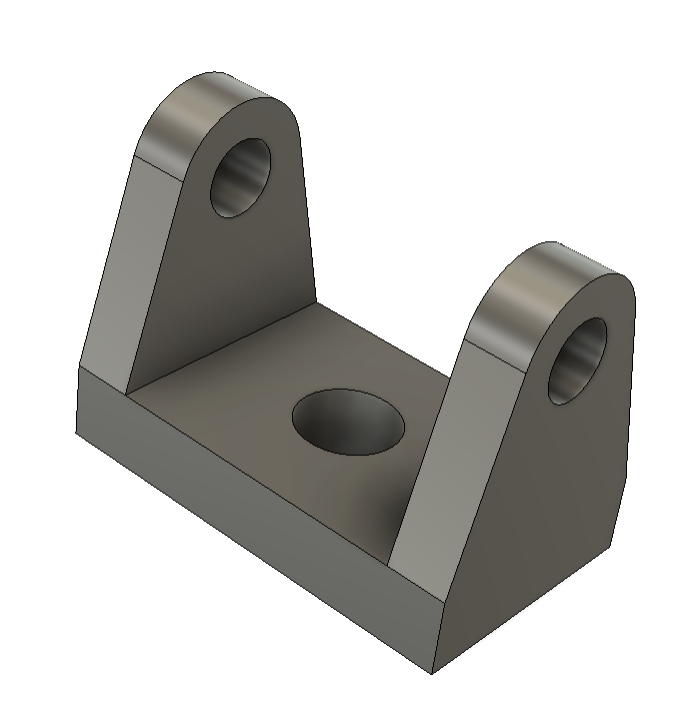
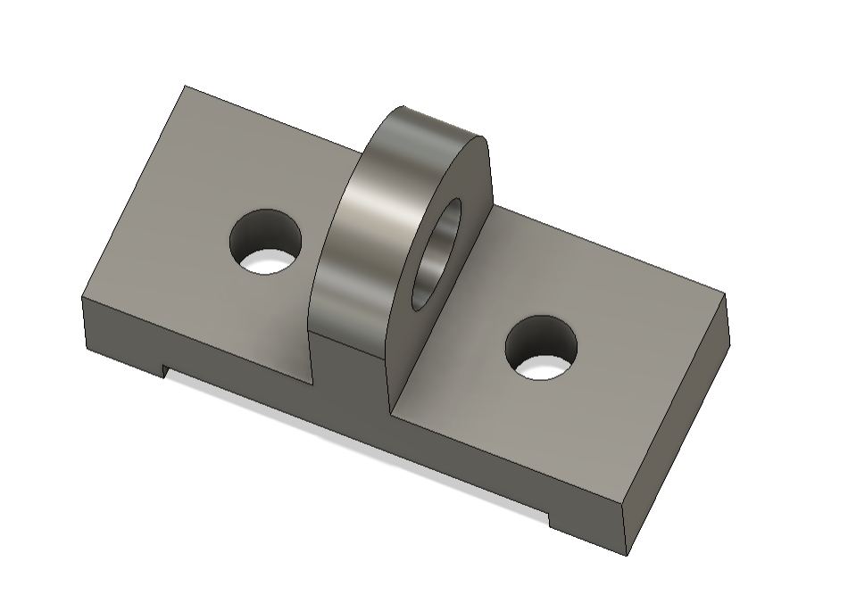

# **Journal du 4 septembre 2026 (rédigé par BAFAYA Winiga Kekeli)**

## **Atelier : conception Assisté par Ordinateur**

---
### Activités
---
- Modelisation des pieces dans fusion comme exercice pratique avec des astuces de conception qui permettent d'aller vite.

| Pieces de l'exercice 01 dans Fusion |
|---|
| |

| Pieces de l'exercice 02 dans Fusion |
|---|
| |

## **Atelier : Python pour FabManager**

---
### Activités
---
Suite de la formation en Python sur l'utilisation :
- Des opérateurs :
    - Opérateurs arithmétiques : ils permettent d'effectuer des calculs, comme l'addition et la multiplication.
    - Opérateurs logiques : ils permettent de combiner ou de modifier des conditions, comme `and`, `or` et `not`.
    - Opérateurs de comparaison : ils permettent de comparer des valeurs, comme `==`, `!=`, `<` et `>`.
    - Opérateurs d'affectation : ils permettent d'attribuer une valeur à une variable, comme avec `=`.
- Des conditions :
    - `if` : exécute un bloc de code si une condition est vraie.
    - `elif` : vérifie une autre condition si la précédente est fausse.
    - `else` : exécute un bloc de code si aucune condition précédente n'est vraie.
- Des boucles :
    - Boucle `for` : répète un bloc de code pour chaque élément d'une séquence.
    - Boucle `while` : répète un bloc de code tant qu'une condition est vraie.
- Des structures de données :
    - Listes : ensembles ordonnés et modifiables de valeurs.
    - Tuples : ensembles ordonnés de valeurs qui ne peuvent pas être modifiés.
    - Dictionnaires : ensembles de paires associant une clé à une valeur.


Exemple de code avec les conditions if, elif et else:
   ``` python
niveau = input(
    "Quel est ton niveau dans le Fablab "
    "(débutant, intermédiaire, avancé ou expert) ? "
).strip().lower()

if niveau == "débutant":
    print("Accès à l'imprimante Prusa MK3 uniquement")
elif niveau == "intermédiaire":
    print("Accès au laser, à la perceuse, à la Bambu et à la CNC")
elif niveau == "avancé":
    print("Accès au laser, à la perceuse, à la Bambu, à la CNC, "
          "à la Prusa et à la DTF")
elif niveau == "expert":
    print("Le Fablab t'appartient")
else:
    print("Niveau non reconnu")

print(type(niveau))
```


## **Ce que j'ai appris**
---

- Les différentes manières de réaliser des modélisations dans Fusion ;
- Les bases de Python, comme les conditions, les opérateurs, les boucles et les structures de données.

### **À faire demain**
---

- Poursuite de la programmation en Python ;
- Poursuite des projets du groupe 25 ;
- Mise au point de tout ce qui a été fait pendant la semaine.
