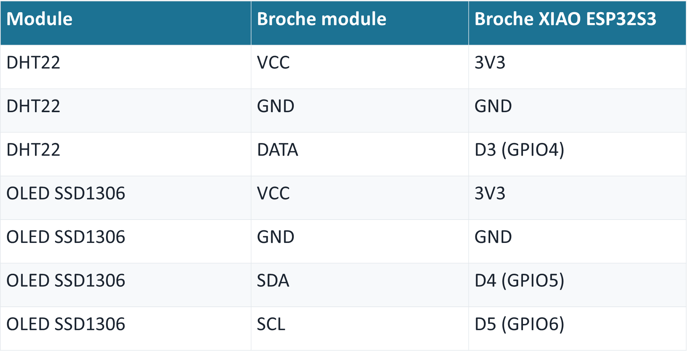

# **Journal du 5 septembre 2026 (rédigé par BAFAYA Winiga Kekeli)**

## **Atelier : Smart Weather Station**

---
### Activités
---

La seance de cette journée a porté sur le montage d'un dispositif de meteo c'est à dire un Smart Weather Station:
Les composants utilisés pour réaliser ce projet sont:

- **Une puce XIOA ESP32S3** : Microcontrôleur, elle exécute le programme MicroPython
---

---
- **Le capteur DHT11** : il mesure la température et l'humidité
---

---
- **Un écran I²C OLED : Écran OLED 0.96" I2C (SSD1306, 128×64)**
---

---
- **Un Breadboard**
- **Des fils de câblage mâle-mâle**
- **Un ordinateur avec Thonny installé**
- **Un câble USB-C**

L'exemple du projet à realiser est presenté sur l'image ci-dessous:
---

---

- Apres cablage en suivant les protocole comme :
 

- **Le capteur de temperature et d'humidité que nous avons obtenu est :**

## **Ce que j'ai appris**
---

- Comment faire le câblage d'un XIAO ESP32S3 avec un ecran OLED et un capteur qui nous sera tres utile dans notre projet de conception et fabrication d'une balance electronique ;
- Comment injecter des codes dans ESP32 avec thonny

### **À faire demain**
---

- Poursuite de la programmation en Python ;
- Poursuite des projets du groupe 25 ;
