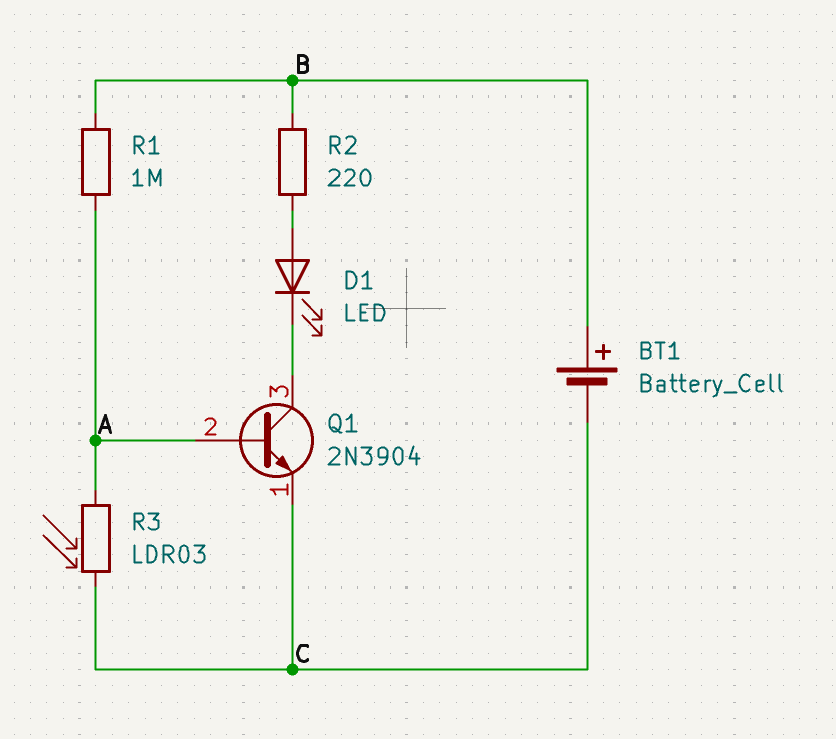
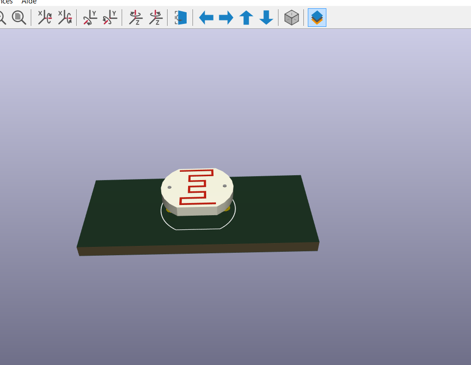
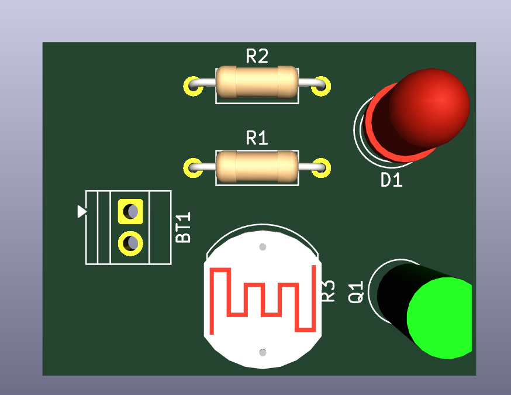
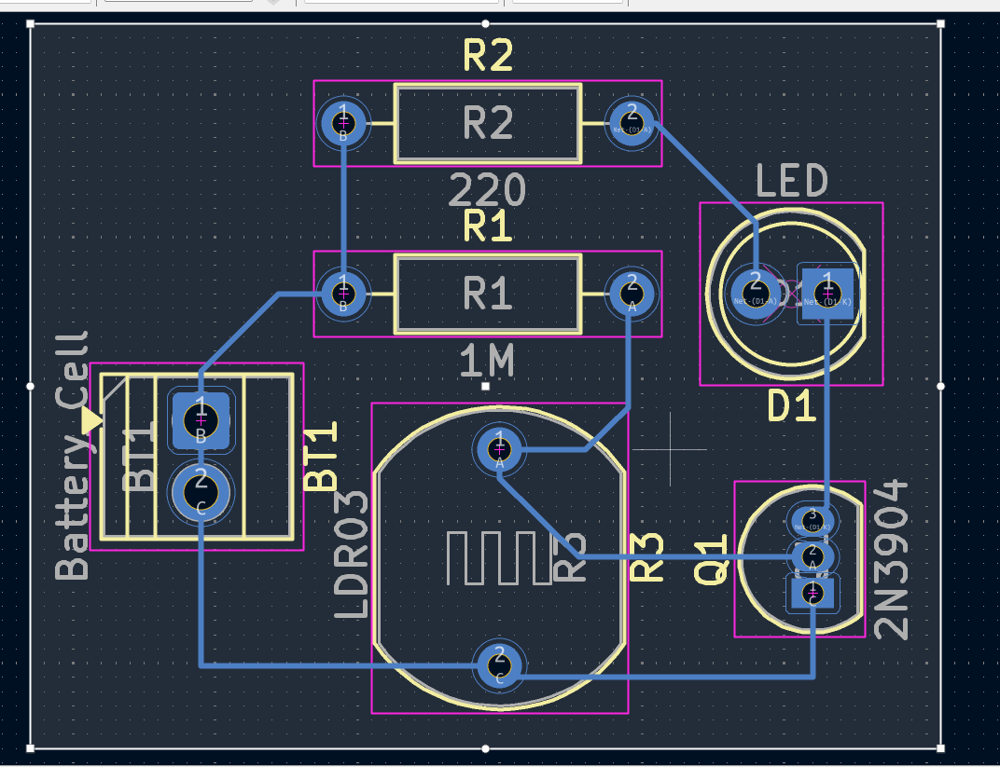
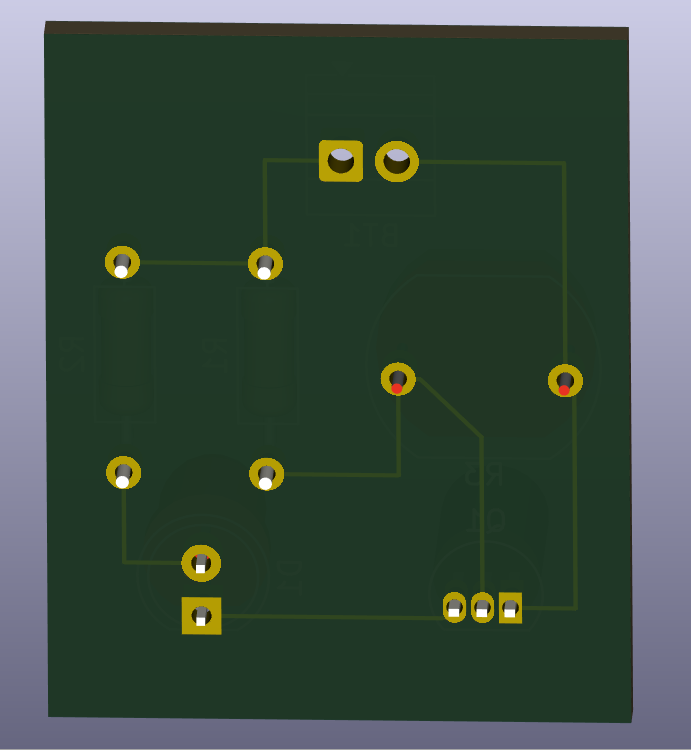

# **Journal du 7 septembre 2026 (rédigé par BAFAYA Winiga Kekeli)**

## **Atelier : Cours d'initiation aux PCB**
Printed Circuit Board, ou circuit imprimé
---
### Activités
---
Initiation au PCB : Printed Circuit Board

### Initiation au PCB (Printed Circuit Board, ou circuit imprimé)

#### Les apprentissages du jour :

L'usage des circuits PCB permet de simplifier les circuits habituellement testés sur les plaquettes SK10. Le PCB favorise ainsi la vulgarisation des circuits électroniques.

Il est préférable de privilégier les circuits PCB par rapport aux circuits réalisés sur breadboard, pour les raisons suivantes :
- câblage volumineux et fragile
- connexions moins fiables
- sensibilité aux vibrations
- difficulté de duplication

L'anatomie d'un PCB comporte les éléments suivants :
- le substrat
- le cuivre
- le solder mask
- le silkscreen
- les pads
- les vias
- les trous de montage (mounting holes)

À partir du schéma ci-dessous, réalisé dans KiCad, nous avons choisi les caractéristiques afin d'éditer le PCB :

Nous pouvons obtenir les vues en 3D des composants comme ci-dessous:

Ainsi, en reliant chaque composant, on obtient :

Après routage, on obtient :

Vue 3D de la plaquette après routage :

### Logiciel utilisé :
- KiCad

## **À faire demain**
---

- Poursuite de la programmation en Python ;
- Poursuite des projets du groupe 25 ;
