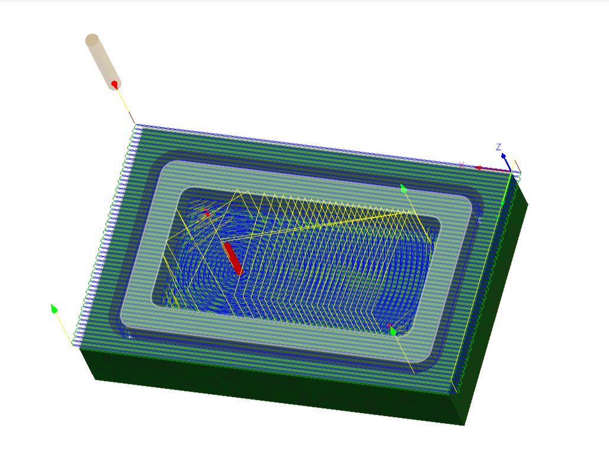
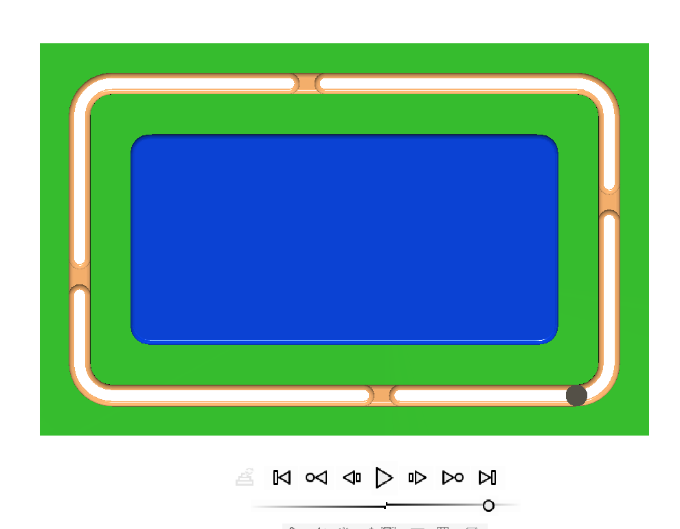
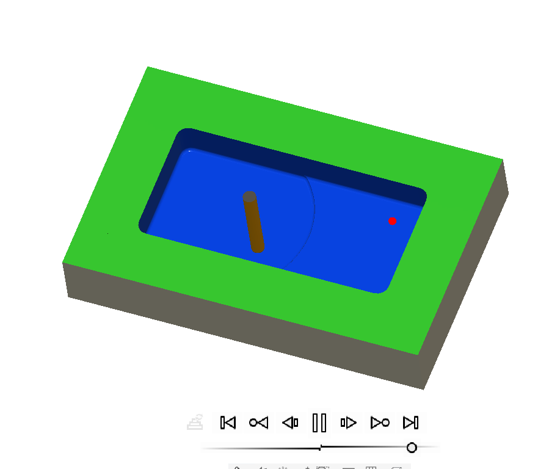

# **Journal du 08 septembre 2026 (rédigé par BAFAYA Winiga Kekeli)**

## **Atelier : Projet**

---
### Activités
---
Lors de ce atelier, nous avons avancé sur le projet en définissant les composants finaux comme suit :
- Le capteur de force ou module de charge de 2 kg ;
- Le module (PCB) HX711 qui va permettre d'amplifier le signal du capteur de force et le transmettre au XIAO ESP32S3 ;
- Le XIAO ESP32S3 qui représente le cerveau ou microcontrôleur ;
- La batterie lithium et le module de charge TP4056 pour l'alimentation et la charge de la batterie ;
- L'écran OLED 0,96" pour l'affichage.

Après avoir défini les composants, nous avons procédé au câblage pour faire la simulation et injecter le code écrit en C++ car le site de simulation ne prend pas le micro-python.

Conclusion : la simulation fonctionne. Il ne reste plus qu'à faire l'essai sur composant physique afin de régler le calibrage et transformer le code en micro-python.

## **Atelier : FAO et usinage CNC**
De la conception à la pièce usinée avec Fusion 360.

---
### Activités
---
Lors de cet atelier, nous avons appris avec monsieur SITOU comment faire la conception, la programmation et la fabrication avec les machines comme la CNC (fraiseuse, tour, découpe laser...).

D'une pièce faite dans l'atelier de conception, nous sommes passés à l'atelier de fabrication afin de régler les paramètres en choisissant les vitesses de coupe et la vitesse d'avance ainsi que les passes à respecter pour obtenir une pièce avec une bonne rigidité.

#### Les apprentissages du jour :

- Comment faire la FAO sur Fusion 360.

### Logiciel utilisé :
- Fusion 360 ;
- Wokwi pour la simulation ;
- VS Code.

## **À faire demain**
---
- Poursuite des projets du groupe 25 ;
