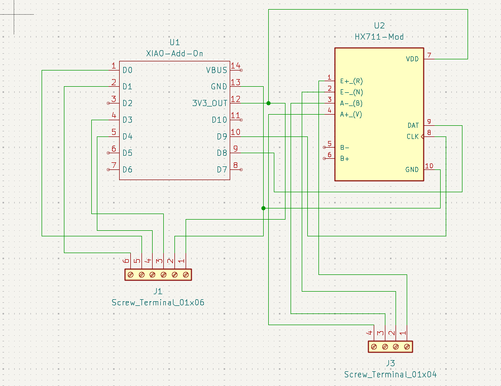
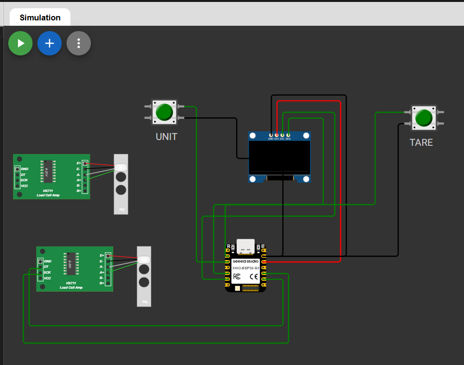

# **Journal du 11 septembre 2026 (rédigé par BAFAYA Winiga Kekeli)**

## **Atelier : Projet Balance electronique connectée et à enregistrement de donnée**

### **Activités**
La journée d’aujourd’hui, le 11 septembre 2026, est la suite de ce qui a été fait la veille.

Les activités du jour sont les suivantes :
- Identification des broches de connexion de chaque composant afin de réaliser le câblage et la conception des PCB.
- Choix de réaliser deux PCB distincts comme suit :
  - PCB 01 pour le microcontrôleur XIAO ESP32 S3 et le module d’amplification HX711
  - PCB 03 pour l’écran et les deux boutons poussoirs : TARE et UNIT
- Début de la réalisation du PCB 01, comme le montre l’image ci-dessous.

- Simulation avec une cellule de charge dans Wokwi.com

- Choix de la technologie à utiliser pour réaliser les PCB
- Choix du pont de Wheatstone pour relier les deux cellules de charge avant de faire la connexion sur le HX711
- Choix des jonctions J1 et J3 pour relier les PCB entre elles : Screw_Terminal_01x06 et J3 Screw_Terminal_01x04
- Dimensionnement de la batterie pour toute la balance :
  LiPo 3,7 V 2000 mAh pour une bonne autonomie

## **Appris**

- Coordination d’un projet de fablab

## **Raté, puis corrigé**

- Manque de matériel (cellule de charge et HX711), donc nous avons décidé de faire des simulations sur Wokwi en attendant la livraison des composants.

## **Décidé**

- Continuer la modélisation, la simulation et le code Python tout en développant le site web.

## **À faire demain**

- Suite de la modélisation si les composants sont livrés ; sinon, suite de la réalisation des PCB
